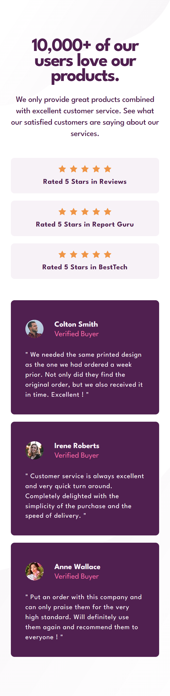

# Frontend Mentor - Social proof section solution

This is a solution to the [Social proof section challenge on Frontend Mentor](https://www.frontendmentor.io/challenges/social-proof-section-6e0qTv_bA). Frontend Mentor challenges help you improve your coding skills by building realistic projects.

## Table of contents

- [Overview](#overview)
  - [The challenge](#the-challenge)
  - [Screenshot](#screenshot)
  - [Links](#links)
- [My process](#my-process)
  - [Built with](#built-with)
- [Author](#author)

## Overview

### The challenge

Users should be able to:

- View the optimal layout for the section depending on their device's screen size

### Screenshot

### Links

- Solution URL: [here](https://github.com/virgile-lab/frontend_mentor/tree/main/11_social-proof-section-master)
- Live Site URL: [here](https://virgile-lab.github.io/frontend_mentor/11_social-proof-section-master/)

### Built with

- Semantic HTML5 markup
- CSS custom properties
- CSS Flexbox
- CSS Grid
- Mobile first approach

## Author

- Frontend Mentor - [@virgile-lab](https://www.frontendmentor.io/profile/virgile-lab)

